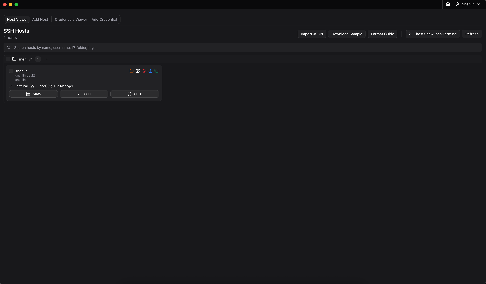

# Terminus

<div align="center">



**A modern, self-hosted server management platform**

[](https://github.com/Snenjih/Terminus/pkgs/container/terminus)
[](LICENSE)
[](https://github.com/Snenjih/Terminus/releases)

[Features](#features) • [Quick Start](#quick-start) • [Installation](#installation) • [Contributing](#contributing)

#### Top Technologies

[](#)
[](#)
[](#)
[](#)
[](#)
[](#)
[](#)
[](#)


</div>

---

## Overview

Terminus is a powerful, self-hosted server management platform that provides comprehensive SSH terminal access, tunneling capabilities, file management, and real-time server monitoring. Built as a modern full-stack TypeScript application, it offers both a responsive web interface and native desktop applications.

### Key Highlights

- 🖥️ **Web-based SSH Terminal** with xterm.js integration
- 🔐 **Secure SSH Tunneling** with health monitoring
- 📁 **Remote File Manager** with dual-panel view
- 📊 **Server Monitoring** for CPU, memory, and disk usage
- 🎨 **Customizable Themes** with dark/light mode
- 🌍 **Multi-language Support** (English, German, Chinese)
- 🔒 **End-to-End Encryption** for sensitive data
- 🖥️ **Desktop Apps** for Windows, Linux, and macOS

---

## Features

### SSH Management
- **Multiple SSH Connections**: Manage unlimited SSH hosts
- **Terminal Sessions**: Full-featured terminal with xterm.js
- **SSH Tunneling**: Create and monitor SSH tunnels (local, remote, dynamic)
- **Credential Management**: Securely store SSH keys and passwords
- **Quick Connect**: Fast connection with saved credentials

### File Management
- **Explorer Mode**: Single-panel file browser
- **Commander Mode**: Dual-panel Orthodox layout (Norton Commander style)
- **Local & Remote**: Manage both local and remote files
- **File Operations**: Upload, download, rename, delete, create
- **Drag & Drop**: Intuitive file transfers
- **Code Editor**: Built-in editor for remote files

### Server Monitoring
- **Real-time Stats**: CPU, memory, disk, and network monitoring
- **Health Checks**: Automatic tunnel health monitoring
- **Alert System**: Configurable alerts for system events

### Security & Privacy
- **At-Rest Encryption**: SQLite database encryption
- **Field-Level Encryption**: Sensitive data encrypted separately
- **JWT Authentication**: Secure session management
- **2FA/TOTP Support**: Optional two-factor authentication
- **OIDC Integration**: Single sign-on capabilities

### User Experience
- **Responsive Design**: Desktop and mobile interfaces
- **Session Restoration**: Automatic workspace recovery
- **Custom Themes**: Full color scheme customization
- **Keyboard Shortcuts**: Productivity-focused hotkeys
- **Internationalization**: Multi-language interface

---

## Quick Start

### Using Docker Compose (Recommended)

The fastest way to get started is using Docker Compose:

```bash
# Download docker-compose.yml
curl -O https://raw.githubusercontent.com/Snenjih/Terminus/main/docker-compose.yml

# Start Terminus
docker compose up -d

# View logs
docker compose logs -f terminus
```

Access Terminus at **http://localhost:30001**

### Using Docker

```bash
# Pull the latest image (web variant - recommended)
docker pull ghcr.io/snenjih/terminus:latest

# Run the container
docker run -d \
  --name terminus \
  -p 30001:30001 \
  -v ./terminus-data:/app/db/data \
  -v ./terminus-uploads:/app/uploads \
  --restart unless-stopped \
  ghcr.io/snenjih/terminus:latest
```

---

## Docker Image Variants

Terminus is available in three Docker image variants to suit different deployment scenarios:

### 🔧 Backend-Only (`ghcr.io/snenjih/terminus:backend`)

**Use Case**: API server for separate frontend deployments or as a central server for desktop apps.

- ✅ REST API and WebSocket endpoints
- ✅ SSH operations (terminal, tunneling, file management)
- ✅ Database and authentication
- ❌ No web interface included
- 📦 Smallest image size (~200MB)

```bash
docker pull ghcr.io/snenjih/terminus:backend
docker run -d -p 30001:30001 --name terminus-api ghcr.io/snenjih/terminus:backend
```

**Perfect for**:
- Teams using desktop applications connecting to a central server
- Custom frontend deployments
- Microservice architectures

### 🌐 Web (`ghcr.io/snenjih/terminus:web`) ⭐ RECOMMENDED

**Use Case**: Complete web application for standard deployments.

- ✅ Full REST API and WebSocket support
- ✅ Web interface (responsive design)
- ✅ All SSH and file management features
- ✅ Complete user management
- 📦 Moderate image size (~300MB)

```bash
docker pull ghcr.io/snenjih/terminus:web
# or use 'latest' tag which points to web
docker pull ghcr.io/snenjih/terminus:latest
```

**Perfect for**:
- Standard web deployments
- Self-hosted server management
- Individual users or small teams
- Docker Compose deployments

### 📦 Full (`ghcr.io/snenjih/terminus:full`)

**Use Case**: Complete deployment with downloadable desktop applications.

- ✅ Everything from Web variant
- ✅ Pre-built Electron desktop apps included
- ✅ Desktop apps available for download from `/downloads`
- 📦 Larger image size (~500MB)

```bash
docker pull ghcr.io/snenjih/terminus:full
docker run -d \
  -p 30001:30001 \
  -v ./terminus-downloads:/app/downloads \
  --name terminus-full \
  ghcr.io/snenjih/terminus:full
```

**Perfect for**:
- Organizations distributing desktop apps internally
- Air-gapped environments needing offline installers
- Complete all-in-one deployments

### Image Comparison

| Feature | Backend | Web | Full |
|---------|---------|-----|------|
| **API Server** | ✅ | ✅ | ✅ |
| **Web Interface** | ❌ | ✅ | ✅ |
| **Electron Downloads** | ❌ | ❌ | ✅ |
| **Image Size** | ~200MB | ~300MB | ~500MB |
| **RAM Usage** | 150MB | 200MB | 250MB |
| **Best For** | API-only | Standard use | Complete package |

### Tagging Strategy

All variants support version-specific tags:

```bash
# Latest (always points to web variant)
ghcr.io/snenjih/terminus:latest

# Variant-specific latest
ghcr.io/snenjih/terminus:backend
ghcr.io/snenjih/terminus:web
ghcr.io/snenjih/terminus:full

# Version-specific
ghcr.io/snenjih/terminus:backend-v1.0.0
ghcr.io/snenjih/terminus:web-v1.0.0
ghcr.io/snenjih/terminus:full-v1.0.0

# Commit SHA (for testing)
ghcr.io/snenjih/terminus:backend-abc1234
```

---

## Installation

### Docker Deployment

#### Prerequisites
- Docker 20.10+
- Docker Compose 2.0+ (optional)

#### Choosing Your Variant

1. **Most Users**: Use the `web` variant (or `latest`)
2. **API Only**: Use the `backend` variant
3. **With Desktop Apps**: Use the `full` variant

#### Environment Variables

| Variable | Default | Description |
|----------|---------|-------------|
| `NODE_ENV` | `production` | Application environment |
| `PORT` | `30001` | HTTP server port |
| `SSL_PORT` | `8443` | HTTPS server port (if SSL enabled) |
| `DATA_DIR` | `/app/db/data` | Data directory for database and config |

#### Volumes

| Host Path | Container Path | Description |
|-----------|----------------|-------------|
| `./terminus-data` | `/app/db/data` | SQLite database and configuration |
| `./terminus-uploads` | `/app/uploads` | File uploads and temporary files |
| `./terminus-ssl` | `/app/ssl` | SSL certificates (optional) |

#### SSL Configuration (Optional)

To enable HTTPS:

1. Place your SSL certificates in the `terminus-ssl` directory:
   - `terminus-ssl/termix.crt`
   - `terminus-ssl/termix.key`

2. Update `docker-compose.yml`:
   ```yaml
   ports:
     - "30001:30001"
     - "8443:8443"
   environment:
     - SSL_PORT=8443
   volumes:
     - ./terminus-ssl:/app/ssl
   ```

3. Restart the container:
   ```bash
   docker compose down && docker compose up -d
   ```

#### Building Docker Images Locally

You can build any variant locally using Docker build targets:

```bash
# Build backend-only variant
docker build --target backend -t terminus:backend .

# Build web variant (standard)
docker build --target web -t terminus:web .

# Build full variant (with Electron builds)
docker build --target full -t terminus:full .

# Build for specific architecture
docker build --platform linux/amd64 --target web -t terminus:web-amd64 .
docker build --platform linux/arm64 --target web -t terminus:web-arm64 .

# Build all variants using docker-compose
docker compose build
```

**Multi-architecture builds** (requires Docker Buildx):

```bash
# Setup buildx (one-time)
docker buildx create --name terminus-builder --use

# Build and push multi-arch images
docker buildx build \
  --platform linux/amd64,linux/arm64 \
  --target web \
  -t myregistry/terminus:web \
  --push \
  .
```

### Desktop Applications

Native desktop applications are automatically built and released for all major platforms:

#### Windows
- **[Terminus-Setup.exe](https://github.com/Snenjih/Terminus/releases/latest)** - Installer (recommended)
- **[Terminus-Windows-Portable.zip](https://github.com/Snenjih/Terminus/releases/latest)** - Portable version (no installation)

#### Linux
- **[Terminus.AppImage](https://github.com/Snenjih/Terminus/releases/latest)** - Universal Linux app (recommended)
- **[Terminus.tar.gz](https://github.com/Snenjih/Terminus/releases/latest)** - Archive version
- **[Terminus-Linux-Portable.zip](https://github.com/Snenjih/Terminus/releases/latest)** - Portable version

#### macOS
- **[Terminus-macOS.dmg](https://github.com/Snenjih/Terminus/releases/latest)** - macOS installer
- Requires macOS 10.13 or later

All desktop applications are built automatically with each release using GitHub Actions and are available on the [Releases page](https://github.com/Snenjih/Terminus/releases).

### Local Development

#### Prerequisites
- Node.js 22+
- npm 10+

#### Setup

```bash
# Clone the repository
git clone https://github.com/Snenjih/Terminus.git
cd Terminus

# Install dependencies
npm install

# Start development servers (frontend + backend)
npm run dev:all

# Or start separately:
npm run dev:backend  # Backend on port 30001
npm run dev          # Frontend on port 5173
```

#### Build

```bash
# Build for production
npm run build

# Build desktop apps
npm run build:win-installer    # Windows installer
npm run build:linux-appimage   # Linux AppImage
npm run build:linux-targz      # Linux tar.gz
```

---

## Architecture

Terminus follows a modern full-stack architecture:

### Frontend
- **Framework**: React 19 with TypeScript
- **Build Tool**: Vite 7
- **UI Library**: Radix UI + shadcn/ui
- **Styling**: Tailwind CSS 4
- **Terminal**: xterm.js 5
- **State Management**: React Context + Hooks
- **Internationalization**: i18next

### Backend
- **Runtime**: Node.js 22+
- **Framework**: Express 5
- **Database**: SQLite with Drizzle ORM
- **SSH**: ssh2 library
- **WebSocket**: ws library
- **Authentication**: JWT + bcrypt
- **File System**: node-pty for terminal sessions

### Desktop
- **Framework**: Electron 38
- **Builder**: electron-builder

### Project Structure

```
Terminus/
├── src/
│   ├── backend/           # Backend TypeScript code
│   │   ├── database/      # Database routes and schema
│   │   ├── ssh/           # SSH operations (terminal, tunnel, file manager)
│   │   ├── local/         # Local file operations
│   │   ├── utils/         # Encryption, auth, logging
│   │   └── starter.ts     # Application entry point
│   ├── ui/                # Frontend React code
│   │   ├── Desktop/       # Desktop layout (≥768px)
│   │   ├── Mobile/        # Mobile layout (<768px)
│   │   └── components/    # Shared UI components
│   ├── types/             # TypeScript type definitions
│   └── locales/           # i18n translations
├── public/                # Static assets
├── electron/              # Electron main process
├── db/data/              # SQLite database (runtime)
└── uploads/              # File uploads (runtime)
```

---

## Configuration

### First-Time Setup

1. Access Terminus at http://localhost:30001
2. Create an admin account
3. Configure your first SSH connection
4. Customize settings and themes

### Settings Overview

- **Application**: Version info, update checks, external links
- **Appearance**: UI customization, layout preferences
- **Color Scheme**: Theme and color palette customization
- **Terminal**: Font size, cursor style, scrollback
- **File Manager**: Layout mode (Explorer/Commander), defaults
- **Hotkeys**: Keyboard shortcut configuration

### Database Encryption

Terminus uses a multi-layer encryption approach:

1. **System-level keys**: JWT secret, database key, internal auth token
2. **User data keys**: Derived from user passwords using bcrypt
3. **Field-level encryption**: SSH keys, passwords, and sensitive credentials
4. **At-rest encryption**: Entire SQLite database file

Keys are stored in `db/data/.system-secrets/` and should **never** be committed to version control.

---

## API Documentation

API documentation is available in OpenAPI format: [openapi.json](./openapi.json)

Key endpoints:

- `/users` - User management and authentication
- `/ssh` - SSH host management
- `/credentials` - SSH credential storage
- `/settings` - User settings
- `/themes` - Color theme management
- `/session` - Session state management

WebSocket endpoints:

- `/terminal` - Terminal session WebSocket
- `/tunnel` - SSH tunnel WebSocket

---

## Development

### Development Commands

```bash
# Frontend development
npm run dev                    # Vite dev server (http://localhost:5173)
npm run build                  # Build frontend and backend
npm run preview                # Preview production build

# Backend development
npm run dev:backend            # Compile and run Express server
npm run build:backend          # Compile backend TypeScript only

# Electron desktop app
npm run electron:dev           # Run Electron in development mode
npm run build:win-portable     # Build Windows portable version
npm run build:win-installer    # Build Windows installer
npm run build:linux-appimage   # Build Linux AppImage
npm run build:linux-targz      # Build Linux tar.gz

# Code quality
npm run clean                  # Format code with Prettier

# Database utilities
npm run test:encryption        # Test encryption functionality
npm run migrate:encryption     # Migrate data to new encryption scheme
```

### Contributing

We welcome contributions! Please see [CONTRIBUTING.md](./CONTRIBUTING.md) for guidelines.

1. Fork the repository
2. Create a feature branch (`git checkout -b feature/amazing-feature`)
3. Commit your changes (`git commit -m 'feat: add amazing feature'`)
4. Push to the branch (`git push origin feature/amazing-feature`)
5. Open a Pull Request

### Commit Convention

We follow [Conventional Commits](https://www.conventionalcommits.org/):

- `feat:` - New features
- `fix:` - Bug fixes
- `refactor:` - Code refactoring
- `docs:` - Documentation changes
- `style:` - Code style changes (formatting)
- `test:` - Test additions or changes
- `chore:` - Build process or auxiliary tool changes

---

## Supported Architectures

Docker images are available for multiple architectures:

- **linux/amd64** - Intel/AMD 64-bit processors
- **linux/arm64** - ARM 64-bit processors (Raspberry Pi 4/5, etc.)

Docker automatically selects the correct image for your platform.

---

## Security

### Reporting Vulnerabilities

If you discover a security vulnerability, please email the maintainer directly instead of using the issue tracker.

### Best Practices

- Always use HTTPS in production (enable SSL)
- Regularly update to the latest version
- Use strong passwords and enable 2FA
- Restrict network access with firewalls
- Regularly backup your database (`db/data/`)
- Never expose the DATA_DIR publicly

---

## Roadmap

- [ ] macOS desktop application
- [ ] Cloud provider integrations (AWS, GCP, Azure)
- [ ] Container management (Docker, Kubernetes)
- [ ] Advanced monitoring and alerting
- [ ] Team collaboration features
- [ ] Plugin system for extensibility
- [ ] Mobile native applications (iOS, Android)

---

## License

This project is licensed under the MIT License - see the [LICENSE](LICENSE) file for details.

---

## Acknowledgments

- [xterm.js](https://xtermjs.org/) - Terminal emulator
- [ssh2](https://github.com/mscdex/ssh2) - SSH client library
- [Radix UI](https://www.radix-ui.com/) - Accessible component primitives
- [shadcn/ui](https://ui.shadcn.com/) - Beautiful UI components
- [Drizzle ORM](https://orm.drizzle.team/) - TypeScript ORM

---

## Support

- 📖 [Documentation](https://github.com/Snenjih/Terminus/wiki)
- 🐛 [Issue Tracker](https://github.com/Snenjih/Terminus/issues)
- 💬 [Discussions](https://github.com/Snenjih/Terminus/discussions)
- 📧 Email: support@terminus.example.com

---

<div align="center">

**Made with ❤️ by [Snenjih](https://github.com/Snenjih)**

[⬆ Back to Top](#terminus)

</div>
